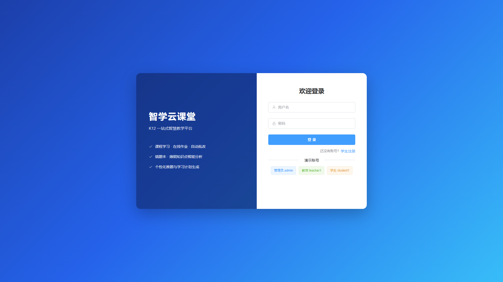
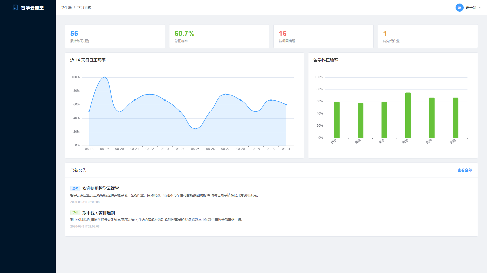
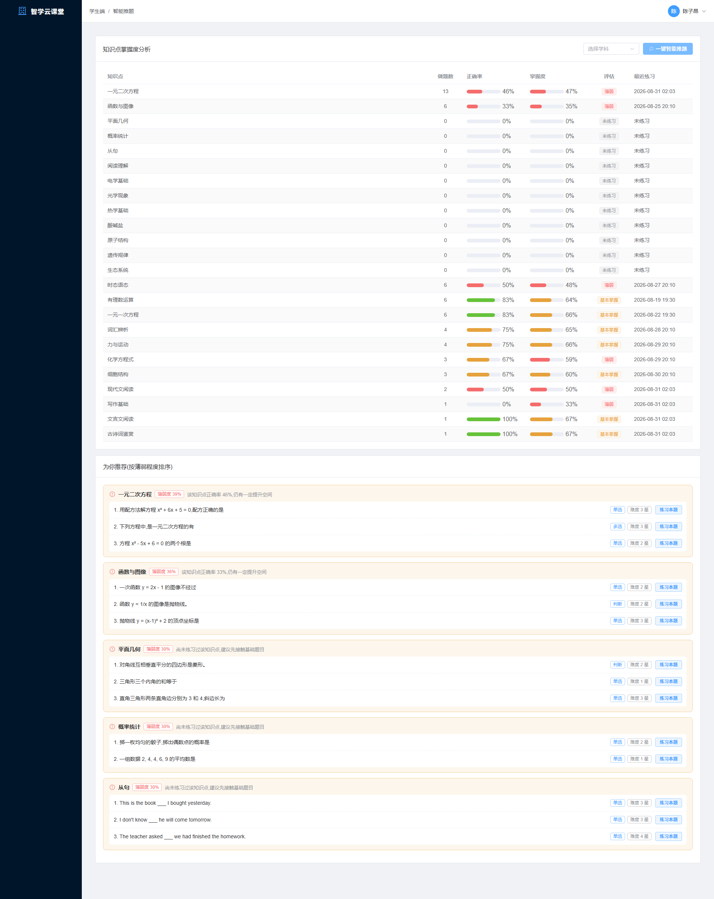
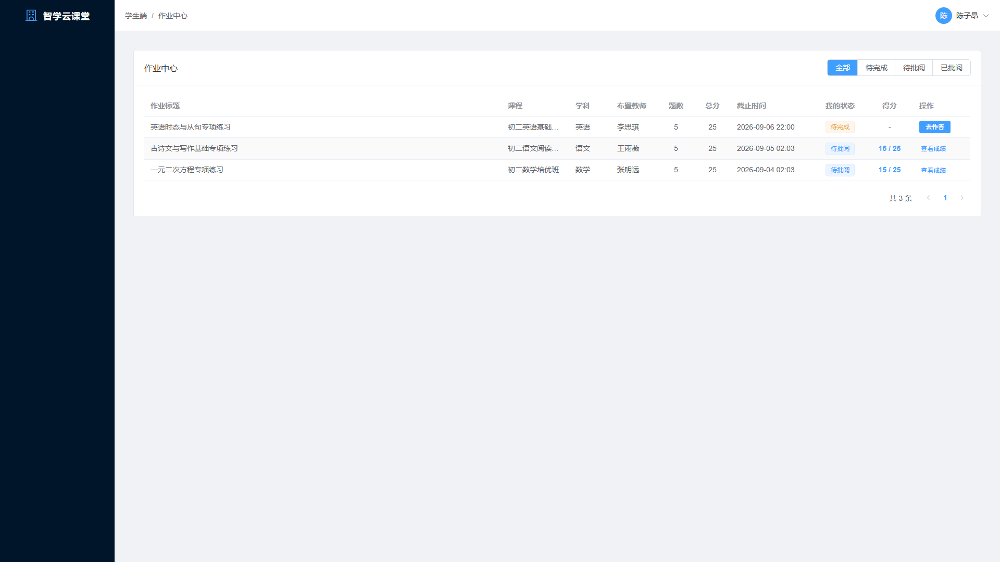
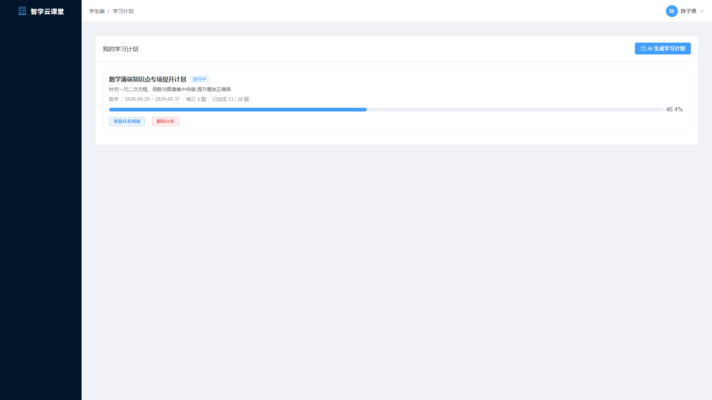
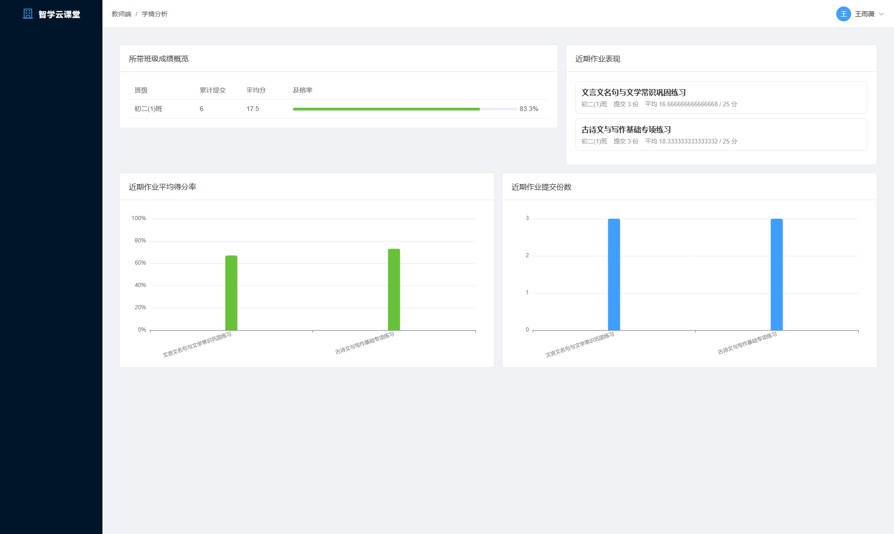
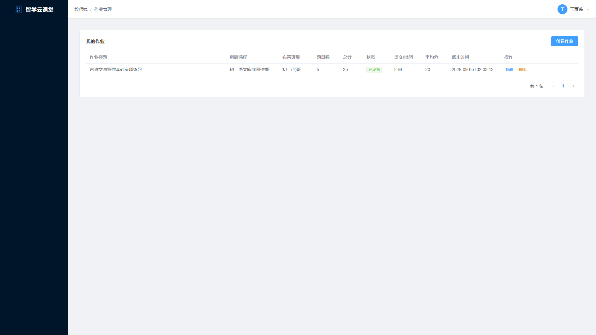
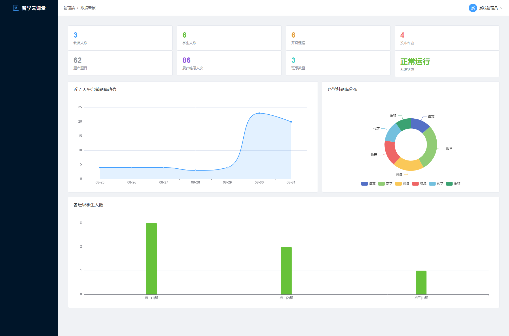

> **SmartClass 智学在线 · K12 学情分析与在线学习** —— 作者：**李玉涛（Leo）**，长春师范大学 数据科学与大数据技术 2027 届。
> 个人技术主页：**[一.chat](https://xn--4gq.chat)**（Punycode: `xn--4gq.chat`）· GitHub：[Leo-Li638](https://github.com/Leo-Li638)
> 更多实践项目：SmartClass 智学在线 · OrderBoss 接单宝 · 绿源环保商城 · 游戏数值作品集 → [一.chat](https://xn--4gq.chat)

# 智学云课堂 SmartClass — K12 一站式智慧教学系统

一个面向 K12 场景的前后端分离教学管理平台,覆盖**教学管理、在线作业、自动批改、错题本、薄弱知识点分析与个性化学习计划**全流程。项目由本人独立完成需求分析、数据库设计、后端接口开发、前端界面开发与联调部署。

## 项目亮点

- **智能推题规则引擎**:基于练习流水实时计算每个知识点的掌握度(拉普拉斯平滑 + 艾宾浩斯遗忘曲线时间衰减),按薄弱度加权推荐题目,生成"薄弱知识点 → 推荐理由 → 专项题目"的可解释推荐结果,无需依赖外部 AI 服务
- **客观题自动判分**:单选/多选/判断/填空四种题型自动批改,多选支持乱序比对,填空支持多候选答案匹配,作业提交即出分
- **三级角色权限体系**:JWT 无状态认证 + 拦截器统一鉴权,管理员/教师/学生 20+ 页面按角色完全隔离,越权访问自动拦截
- **学情数据可视化**:管理端平台看板、教师端班级学情分析、学生端个人学习看板,基于 ECharts 呈现做题趋势、学科正确率、知识点掌握度等多维数据
- **学习计划自动生成**:分析薄弱知识点后按薄弱度分配每日题量,生成按天推进的任务清单,进度通过练习流水实时回算,无需手动打卡
- **工程化实践**:统一响应结构与全局异常处理、MyBatis-Plus 字段自动填充、幂等 SQL 初始化脚本、首次启动自动灌入演示数据、Swagger 接口文档、本地私密配置与仓库分离

## 技术栈

| 层次 | 技术 | 说明 |
| --- | --- | --- |
| 后端框架 | Spring Boot 3.2 | Java 17,内嵌 Tomcat |
| 持久层 | MyBatis-Plus 3.5 | Lambda 查询、分页插件、字段自动填充 |
| 数据库 | MySQL 8.0 | 16 张业务表,utf8mb4 |
| 认证鉴权 | JWT (jjwt 0.12) + HandlerInterceptor | 无状态登录,三级角色控制 |
| 接口文档 | SpringDoc OpenAPI (Swagger UI) | 在线调试全部 REST 接口 |
| 前端框架 | Vue 3.4 (Composition API) | `<script setup>` 组合式写法 |
| UI 组件库 | Element Plus 2.7 | 中文国际化 |
| 状态/路由 | Pinia 2 + Vue Router 4 | 登录态持久化,路由级权限守卫 |
| 可视化 | ECharts 5 | 趋势折线图、柱状图、掌握度进度条 |
| 构建工具 | Vite 5 | 开发热更新,生产构建 |

## 系统架构

```
┌────────────────────────── 浏览器 ──────────────────────────┐
│   管理端(ADMIN)      教师端(TEACHER)      学生端(STUDENT)   │
│        └────────────── Vue 3 SPA (Element Plus) ──────────┘ │
└──────────────────────────┬─────────────────────────────────┘
                           │  HTTP / JSON (Axios)
┌──────────────────────────▼─────────────────────────────────┐
│                    Vite DevServer / Nginx                   │
│                  代理 /api → localhost:8091                 │
└──────────────────────────┬─────────────────────────────────┘
                           │
┌──────────────────────────▼─────────────────────────────────┐
│                 Spring Boot 3 (REST API)                    │
│  ┌──────────┐  ┌──────────┐  ┌──────────┐  ┌────────────┐  │
│  │ 认证模块  │  │ 管理模块  │  │ 教学模块  │  │  学习模块   │  │
│  │ Auth     │  │ Admin    │  │ Teacher  │  │  Student   │  │
│  └────┬─────┘  └────┬─────┘  └────┬─────┘  └─────┬──────┘  │
│       └─────────────┴─────┬───────┴──────────────┘         │
│                ┌──────────▼───────────┐                     │
│                │  Service 业务层       │                     │
│                │  · 规则引擎(推题/计划) │                     │
│                │  · 自动判分 Grader    │                     │
│                │  · 练习流水记录器      │                     │
│                └──────────┬───────────┘                     │
│         MyBatis-Plus (Mapper / 分页插件 / 自动填充)           │
└──────────────────────────┬─────────────────────────────────┘
                           │ JDBC
                    ┌──────▼──────┐
                    │  MySQL 8.0  │
                    │  16 张业务表 │
                    └─────────────┘
```

## 功能总览

### 管理端
- 数据看板:教师/学生/课程/作业/题量等核心指标,近 7 天做题趋势、学科题库分布、班级人数分布
- 用户管理:管理员/教师/学生账号的增删改查、重置密码、启用停用
- 班级管理、学科管理、课程管理(上下架)、系统公告(按角色定向发布)

### 教师端
- 题库管理:按学科/知识点/题型/难度/关键词检索,四种题型的增删改
- 作业管理:从题库选题组卷、设置分值与截止时间、发布/撤回
- 作业批阅:查看学生提交列表与客观题自动判分结果,填写评语完成批阅
- 学情分析:所带班级成绩概览(提交数/平均分/及格率)、单份作业知识点分析
- 我的课程:课程维护与学习资料(讲义/视频/外链)管理

### 学生端
- 学习看板:累计练习、总正确率、待巩固错题、待完成作业,近 14 天正确率趋势与学科正确率
- 作业中心:在线答题、交卷即自动判分、查看成绩单与逐题解析
- 自主练习:按学科/难度/题量抽题组卷,逐题作答即时反馈
- 智能推题:知识点掌握度分析(做题数/正确率/掌握度/薄弱度),一键生成薄弱知识点专项推荐
- 错题本:错题自动收录,支持重做、标记掌握、移出
- 学习计划:按学科与天数生成薄弱知识点突破计划,每日任务进度实时回算
- 课程学习:浏览上架课程与学习资料

## 系统截图

### 登录页(支持演示账号一键填充)



### 学生端

| 学习看板 | 智能推题 |
| :---: | :---: |
|  |  |
| **作业中心** | **学习计划** |
|  |  |

### 教师端

| 学情分析 | 作业管理 |
| :---: | :---: |
|  |  |

### 管理端



## 智能推题算法设计(核心)

推荐结果完全由**可解释的规则引擎**驱动,数据来自学生的历史练习流水(`practice_record` 表):

1. **原始正确率**:`accuracy = correct / total`,样本少时波动剧烈
2. **拉普拉斯平滑**:`mastery = (correct + 1) / (total + 2)`,避免只做 1 题对/错就判定 100%/0% 掌握
3. **遗忘曲线衰减**:按最近一次练习距今天数对掌握度做指数衰减 `mastery *= exp(-λ·days)`,长期未练习的知识点掌握度自动下滑
4. **薄弱度得分**:`weakScore = (1 - mastery) × 权重`,同时考虑练习量不足的因素
5. **推荐生成**:取薄弱度 Top-N 知识点,按薄弱度占比分配推荐题量,从题库中优先匹配中等难度题目,并给出人类可读的推荐理由(如"该知识点正确率 45%,建议优先巩固")

学习计划复用同一套掌握度分析:总题量 = 天数 × 每日题量,按薄弱度加权分配到各知识点,再均匀铺到每一天。

## 数据库设计(16 张表)

| 分组 | 表 | 说明 |
| --- | --- | --- |
| 基础 | `user` / `clazz` / `subject` / `course` / `course_material` | 用户、班级、学科、课程与资料 |
| 题库 | `knowledge_point` / `question` | 知识点与题目(选项以 JSON 数组存储) |
| 作业 | `homework` / `homework_question` / `homework_submit` / `homework_answer` | 作业定义、组卷关联、提交记录、逐题作答 |
| 学习 | `practice_record` / `wrong_book` / `study_plan` / `plan_task` | 练习流水、错题本、学习计划与每日任务 |
| 系统 | `notice` | 系统公告 |

建表脚本见 [`smartclass-backend/src/main/resources/db/schema.sql`](smartclass-backend/src/main/resources/db/schema.sql),幂等可重复执行;首次启动自动灌入 6 学科 62 道题、演示账号与两周练习流水,开箱即可看到完整效果。

## 快速开始

### 环境要求

| 软件 | 版本 | 说明 |
| --- | --- | --- |
| JDK | 17+ | 后端编译运行 |
| Maven | 3.8+ | 依赖管理(IDEA 自带亦可) |
| MySQL | 8.0+ | 数据存储 |
| Node.js | 18+ | 前端开发与构建 |

### 第一步:准备数据库

MySQL 中执行(只需建库,表结构与数据由应用启动时自动初始化):

```sql
CREATE DATABASE smart_class DEFAULT CHARACTER SET utf8mb4 COLLATE utf8mb4_unicode_ci;
```

### 第二步:配置数据库密码

复制模板为本地配置文件,并填入你的 MySQL 密码:

```
smartclass-backend/src/main/resources/application-local.example.yml
→ 复制为同目录 application-local.yml,修改 password
```

`application-local.yml` 已被 `.gitignore` 忽略,密码不会进入版本库。

### 第三步:IDEA 中运行后端

1. IDEA → `File` → `Open` → 选择 `smartclass-backend` 目录(Maven 项目自动识别)
2. `File` → `Project Structure` → 确认 Project SDK 为 **JDK 17**
3. 等待 Maven 依赖下载完成(右下角进度条)
4. 找到启动类 `com.smartclass.SmartClassApplication` → 右键 `Run`
5. 控制台出现 `Started SmartClassApplication` 即启动成功,服务地址 `http://localhost:8091`
6. 接口文档:`http://localhost:8091/swagger-ui.html`

### 第四步:运行前端

```bash
cd smartclass-frontend
npm install
npm run dev
```

浏览器访问 `http://localhost:5181`(Vite 已配置代理,`/api` 请求自动转发到 8091)。

### 演示账号

| 角色 | 账号 | 密码 | 说明 |
| --- | --- | --- | --- |
| 管理员 | admin | admin123 | 平台管理 |
| 教师 | teacher1 | teacher123 | 王雨薇,带语文作业与提交记录 |
| 教师 | teacher2 / teacher3 | teacher123 | 其他演示教师 |
| 学生 | student1 | student123 | 陈子昂,有完整学情画像(错题/薄弱点/计划) |
| 学生 | student2 ~ student6 | student123 | 其他演示学生 |

登录页支持点击演示账号标签快速填充。

## 项目结构

```
smartclass
├── smartclass-backend                 # Spring Boot 后端
│   ├── pom.xml
│   └── src/main
│       ├── java/com/smartclass
│       │   ├── SmartClassApplication.java   # 启动类
│       │   ├── common/          # 统一响应、异常、常量
│       │   ├── config/          # MyBatis-Plus、Web、演示数据初始化
│       │   ├── interceptor/     # 登录鉴权拦截器
│       │   ├── util/            # JWT、用户上下文、JSON 工具
│       │   ├── entity/          # 16 张表实体
│       │   ├── mapper/          # MyBatis-Plus Mapper
│       │   ├── dto/             # 请求参数对象
│       │   ├── vo/              # 响应视图对象
│       │   ├── service/         # 业务逻辑(含推题规则引擎、判分器)
│       │   └── controller/      # REST 接口(6 个控制器)
│       └── resources
│           ├── application.yml          # 主配置(密码走环境变量/本地文件)
│           ├── application-local.example.yml
│           └── db/                      # 幂等建表与种子数据脚本
├── smartclass-frontend                # Vue 3 前端
│   ├── vite.config.js                 # Vite 配置与 API 代理
│   └── src
│       ├── api/          # Axios 接口封装(按角色拆分)
│       ├── router/       # 路由与权限守卫
│       ├── store/        # Pinia 登录态
│       ├── layout/       # 侧边栏 + 顶栏主布局
│       ├── components/   # 通用答题卡片组件
│       ├── styles/       # 全局样式
│       └── views/        # 20+ 页面(admin / teacher / student / common)
└── docs/images                         # 系统截图
```

## 接口概览

后端共 6 个控制器、70+ 个 REST 接口,启动后访问 Swagger UI 在线调试:`http://localhost:8091/swagger-ui.html`

| 控制器 | 前缀 | 职责 |
| --- | --- | --- |
| AuthController | `/api/auth` | 登录、注册、个人信息、修改密码 |
| AdminController | `/api/admin` | 用户/班级/学科/公告管理、平台看板 |
| TeacherController | `/api/teacher` | 题库、作业发布与批阅、学情分析 |
| StudentController | `/api/student` | 作业作答、练习、错题本、推题、计划、看板 |
| CourseController | `/api/courses` | 课程与学习资料 |
| CommonController | `/api/common` | 按角色过滤的系统公告 |

## 后续规划

- 接入大模型 API 实现主观题智能批改与讲解生成(当前规则引擎架构已预留扩展点)
- 刷题小程序端(微信)与家长端学情报告
- 支付与课程商城模块,支撑商业化运营

## 常见问题

<details>
<summary><b>后端启动报 "Communications link failure" / 连接被拒绝</b></summary>

确认 MySQL 服务已启动,且 `application-local.yml` 中的密码与本机一致;数据库需先手动创建(见"快速开始"第一步)。
</details>

<details>
<summary><b>后端启动报 "不支持发行版本" 或编译异常</b></summary>

`File → Project Structure → Project SDK` 选择 JDK 17 及以上;`Settings → Build Tools → Maven → Runner` 的 JRE 同样设为 JDK 17。
</details>

<details>
<summary><b>前端页面能打开但接口全部报错</b></summary>

后端未启动或端口被占用:先确认 `http://localhost:8091` 可访问;若 8091 被占用,在 `application.yml` 修改 `server.port` 并同步修改 `vite.config.js` 的代理目标。
</details>

<details>
<summary><b>5181 端口被占用</b></summary>

前端已固定端口 5181(strictPort),被占用时会直接启动失败而不是换端口,先释放 5181(或临时改 vite.config.js 的 port,注意与 agent-radar 的 5180 区分)。
</details>

<details>
<summary><b>想重置演示数据</b></summary>

删除数据库后重新建库再启动,应用检测到空库会自动重新执行建表与种子数据脚本(脚本幂等,也可直接重复执行)。
</details>

## License

本项目采用 **GNU Affero General Public License v3.0 (AGPL v3)** 授权。

之所以选择 AGPL 而非更宽松的 MIT，是因为本项目未来计划作为商业化教学平台运营，
AGPL 能确保任何第三方将本项目代码部署为网络服务对外提供时，必须公开其修改部分。

详情见 [LICENSE](./LICENSE)。

---

© 2026 [Leo-Li638](https://github.com/Leo-Li638) · 个人独立 AI 辅助开发项目
